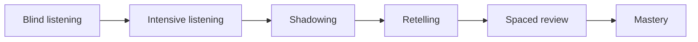

<div align="right">
  <strong>English</strong> | <a href="./README.md">简体中文</a>
</div>

<div align="center">
  
  <h1>Echo Loop — Turn one piece of English into real skill</h1>
  <p><strong>Blind listening · Intensive listening · Shadowing · Retelling · Spaced review</strong></p>
  <p>An English listening and speaking app built around real audio materials, with an automatically guided practice loop.</p>
  <p><sub><em>Academically advised by <a href="https://sfs.muc.edu.cn/info/1063/3729.htm">Yang Yan</a> from the School of Foreign Studies, Minzu University of China.</em></sub></p>
  <p>
    <a href="./LICENSE"></a>
    
    <a href="https://github.com/echo-loop/Echo-Loop/releases/latest"></a>
    <a href="https://github.com/echo-loop/Echo-Loop/commits/main"></a>
  </p>
  <p>
    <a href="https://apps.apple.com/app/id6760324074"></a>
    <a href="https://play.google.com/store/apps/details?id=app.echoloop"></a>
  </p>
</div>

> 🇨🇳 **Note for users in mainland China**: The China App Store listing is temporarily unavailable while ICP registration is in progress. You can install Echo Loop with an App Store account from another region.

## What is Echo Loop?

Echo Loop turns one piece of audio into a sequence of practical tasks: listen once without subtitles, understand it sentence by sentence, shadow difficult sentences, retell the passage, and review it on a memory schedule. Import podcasts, lessons, or videos you already like, or start with an official collection. Your progress, difficult sentences, and saved vocabulary stay organized so “I heard it” can become “I understand it, can say it, and remember it.”

The core learning loop is free. AI features and subscriptions enhance the experience without blocking core playback or practice.

## Screenshots

<table>
  <tr>
    <td align="center"><br/><sub>Import audio</sub></td>
    <td align="center"><br/><sub>Intensive listening</sub></td>
    <td align="center"><br/><sub>Sentence analysis</sub></td>
    <td align="center"><br/><sub>Paragraph retelling</sub></td>
    <td align="center"><br/><sub>Saved-content review</sub></td>
  </tr>
</table>

## Current features

### Learning and playback

- Import local audio and video in batches; import SRT / VTT / LRC subtitles or generate subtitles with AI transcription.
- Blind listening, sentence-by-sentence intensive listening, difficult-sentence shadowing, paragraph retelling, difficult-sentence drills, and freestyle practice.
- Audio/video playback, synchronized subtitles, waveform, sentence/full/saved-range playback, background playback, and sleep timer.
- Subtitle editing, sentence-level timelines, sense-group annotations, and organized learning materials.
- Browse official collections and podcasts, or import materials from Baidu Netdisk.

### Saved content and spaced review

- Save sentences, words, and sense groups, then review them in their original context.
- FSRS-based saved-sentence and saved-vocabulary review with ratings, playback preferences, and next-review scheduling.
- Review statistics including today’s reviews, retention, rating distribution, 30-day trends, upcoming reviews, and streaks.
- Automatic progress saving, resume where you left off, reminders, and a learning calendar.

### Dictionary, pronunciation, and AI

- Local dictionary, offline pronunciation, AI dictionary, and web dictionary with switchable sources.
- AI translation, sentence analysis, word deep dives, and contextual vocabulary explanations.
- Sentence-level multi-turn AI assistant with streaming responses, follow-up questions, quoted context, and regeneration.
- Platform TTS plus local Kokoro / Piper TTS; offline ASR shadowing evaluation and transcription.

### Data and subscriptions

- Export learning materials as printable PDFs.
- Streamed local backup and restore with failure rollback; backups exclude login sessions and re-downloadable resources.
- Email, Google, and Apple sign-in.
- Native in-app subscriptions on iOS / Android and Paddle on supported alternate channels. AI usage is enforced by the backend.

## The learning loop



After the first pass, reviews are scheduled at 6 hours, 1 day, 2 days, 4 days, 7 days, 14 days, and 28 days. The actual review content adapts to your learning state and saved items.

## Download

- [App Store](https://apps.apple.com/app/id6760324074)
- [Google Play](https://play.google.com/store/apps/details?id=app.echoloop)
- [Android APK / Releases](https://github.com/echo-loop/Echo-Loop/releases)

Desktop: macOS is under active development; Windows is not officially released; there is no Web version planned at present.

## Roadmap

Completed core capabilities include the learning loop, saved-content review, official collections, AI translation and analysis, the sentence-level AI assistant, PDF export, subscriptions and AI quotas, backup and restore, and cross-platform playback and speech features.

Current focus:

- Fix a native crash after ending offline ASR recording on some Android devices.
- Finish the shared recording/recognition path for paragraph retelling and cross-platform release validation.
- Continue polishing startup performance, playback, dictionaries, PDF export, subtitle editing, and the production subscription flow.

See [PLAN.md](./PLAN.md) and [TASKS.md](./TASKS.md) for detailed project status.

## Community

- [QQ group](https://qm.qq.com/q/qmyXIv341q)
- [Contact us on WeChat](https://i.postimg.cc/P5tVpPTV/echo-loop-wecom.jpg)
- [Bilibili](https://space.bilibili.com/509449049/upload/video)
- [Xiaohongshu](https://xhslink.cn/m/4zOdGUcDH4N)

## For developers

```bash
git clone git@github.com:echo-loop/Echo-Loop.git
cd Echo-Loop
cp .dev.env.template .dev.env
flutter pub get
dart run build_runner build
flutter run -d <ios|android|macos> --dart-define-from-file=.dev.env
```

Compile-time variables (`SUPABASE_URL`, `SUPABASE_PUBLISHABLE_KEY`, `GOOGLE_WEB_CLIENT_ID`, and `API_BASE_URL`) belong in `.dev.env` or `.prod.env` and are injected with `--dart-define-from-file`. These environment files are gitignored; never commit secrets.

Before submitting a change:

```bash
flutter analyze
flutter test
```

## Technology

Flutter · Dart · Riverpod · Drift / SQLite · just_audio · media_kit · sherpa_onnx · Flutter TTS · Supabase · Firebase · PostHog · Material 3

## License and acknowledgements

Licensed under [AGPL-3.0](./LICENSE). Thanks to [Yang Yan](https://sfs.muc.edu.cn/info/1063/3729.htm) for guiding the project’s learning methodology.
